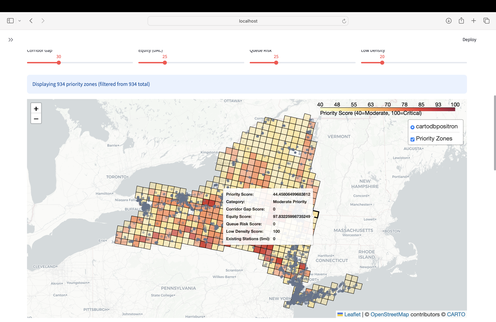
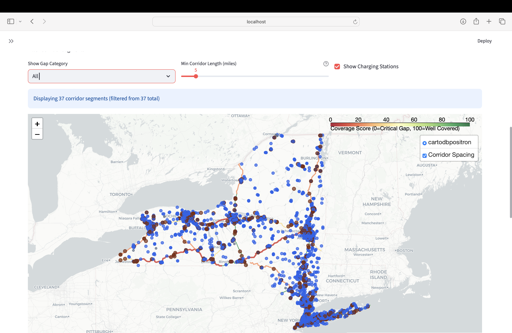
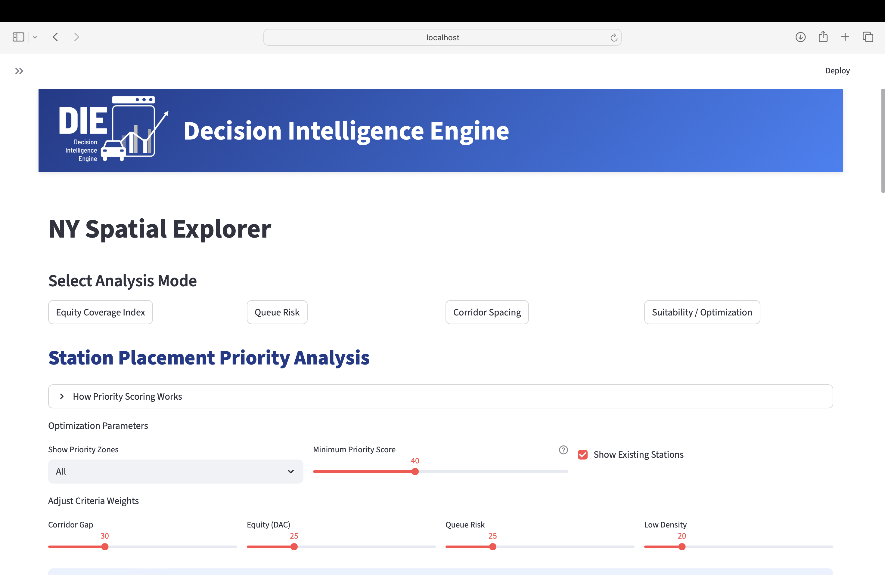

# EV Infrastructure Equity Analyzer

An interactive Streamlit web application for analyzing zero-emission vehicle (ZEV) 
infrastructure equity, corridor coverage gaps, and charging station suitability 
across New York State. Built for transportation planners and policymakers.

## Screenshots

### Landing Page


### Station Placement Priority Analysis


### Corridor Spacing Analysis


### Optimization Parameters


## Features

- **Equity Coverage Index** — identifies underserved communities and DAC zones 
  lacking adequate EV charging access
- **Queue Risk Analysis** — flags high-demand stations at risk of congestion 
  based on EV registration density
- **Corridor Spacing Analysis** — evaluates charging coverage along NYS highway 
  corridors with gap categorization (Well Covered / Adequate / Moderate Gap / Critical Gap)
- **Station Placement Priority** — multi-criteria optimization scoring 934 priority 
  zones across NYS with adjustable weights for corridor gap, equity, queue risk, 
  and low-density factors
- **Interactive Maps** — real-time filtering, sliders, and toggles built with 
  Folium and Leaflet

## Tech Stack

Python · Streamlit · GeoPandas · Folium · Pandas · NumPy · Shapely

## Data Sources

All data used is publicly available:
- NYSERDA Disadvantaged Communities Shapefile
- Alternative Fuels Corridors (FHWA / AltFuels)
- NY EV Charging Stations (AFDC / DOE)
- NY EV Registrations (NYS DMV)
- Census Tract Boundaries (US Census Bureau)
- NYS Civil Boundaries

## Running Locally

This tool requires geospatial datasets (EV stations, census tracts, corridor 
shapefiles) that are publicly available from the sources listed above. Download 
and place them in the `Spatial/Data/` and `Spatial/GEOJSON/` directories, 
then run:
```bash
pip install -r requirements.txt
streamlit run app.py
```

Data loading scripts are provided in `convert_geopandas.py` to preprocess 
raw shapefiles into the required GeoJSON format.

## Status

Presented to transportation planners at the NY Upstate Planners Conference (2025). 
Active development.
